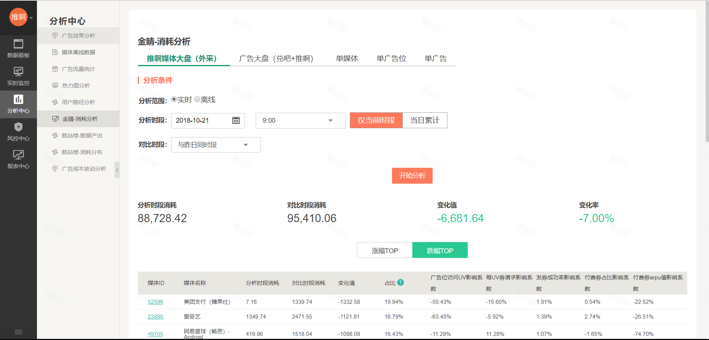
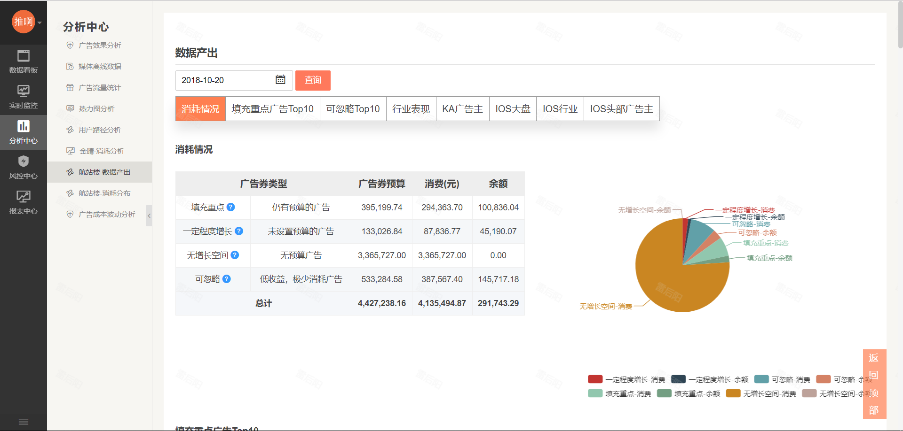
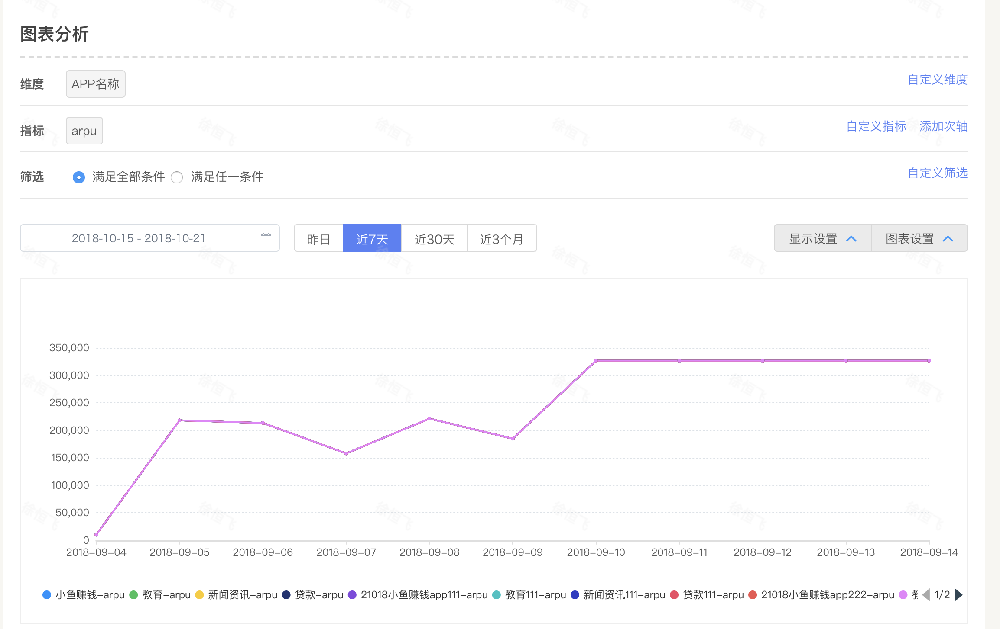
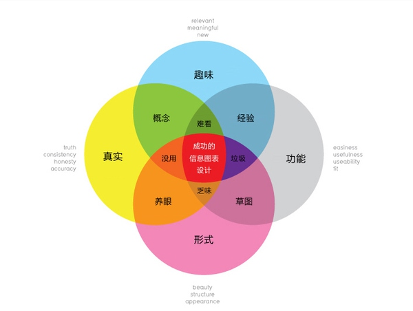
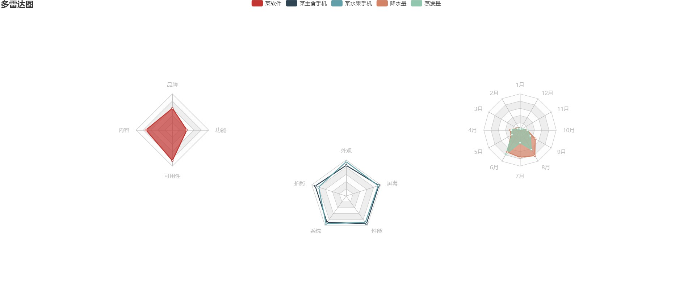

#  火眼系统

## 重点项目及解决痛点

### 1.金睛    
#### 背景：  
如果业务出现波动，广告线定位原因较低效，业务需要人工排查原因。媒体线金睛一期分析的方案存在一定的不合理性，指标的波动和不一定是造成大盘消耗波动的主要原因，且分析到广告相关指标时，粒度过细，不够直观。  
#### 目标：  
1、30分钟发现大盘消耗波动，5分钟内定位问题  
2、报警功能使用率从30%提升至80%
#### 解决痛点
1.缺少报警设置，大盘出现波动的时候无法第一时间感知  

2.大盘出现异常，业务人员无法清晰知道业务波动的原因  

3.报警后缺少原因分析，报警后还需要人工排查原因，需要浪费较多的时间  

4.指标的波动和不一定是造成大盘消耗波动的主要原因，且分析到广告相关指标时，粒度过细，不够直观。  
 

### 2.航站楼    
#### 背景：  
目前每日消耗总值，占当日可以消耗余额82%左右。业务分析昨天剩余预算消耗情况，需要花费2-3小时。 
#### 目标：  
1、每日早上9之前产出昨日剩余预算分析报告  
2、为年度目标合理使用流量，12月份消耗/（消耗+剩余预算）占比提升3%提供基础
#### 解决痛点：  
1.剩余预算消耗不完，没有对应的消耗建议  
2.没有稳定的剩余预算报告，每次产出需要花费2-3小时  

### 3.定制看板    
#### 背景：  
用户类型（岗位多）：大到核心领导，小到基础运营
每个用户（至少是每种岗位的用户，如媒体运营和活动运营）日常关注的数据不一样，需要做到“千人千面”
#### 目标：  
1、每个人可以自己设计看板（前提：很清楚自己应该看什么数据，怎么设置）  
2、为每个角色设计对应的看板，开放给对应的角色  
3、定制看板后可以分享给其他同事（这种方案需要考虑内容权限的问题，如媒体运营设置了一个看板，媒体是属于自己的媒体，那分享给其他媒体运营后，大家也需要只能看到自己的媒体，而不是所有媒体）
#### 解决痛点：  
1、监控告警，引导用户定位问题  
2、分析数据，定位问题原因  
3、快速获取业务整体重点数据情况

## 数据可视化

### 什么是可视化
有人说，数据可视化不就是画图嘛，看不出来研究的价值在哪。我原来也天真的以为，数据可视化就是把数据从冰冷的数字转换成图形，顶多就是色彩丰富一些，看起来更酷炫，逼格满满。其实不然，一个好的可视化，能够带给人们不仅仅是视觉上的冲击，还能够揭示蕴含在数据中的规律和道理。
数据可视化的目的其实就是直观地展现数据，例如让花费数小时甚至更久才能归纳的数据量，转化成一眼就能读懂的指标；通过加减乘除、各类公式权衡计算得到的两组数据差异，在图中颜色敏感、长短大小即能形成对比；数据可视化是一个沟通复杂信息的强大武器。通过可视化信息，我们的大脑能够更好地抓取和保存有效信息，增加信息的印象。但如果数据可视化做的较弱，反而会带来负面效果；错误的表达往往会损害数据的传播，完全曲解和误导用户，所以更需要我们多维的展现数据，就不仅仅是单一层面，

### 可视化的意义
可视化的终极目标是洞悉蕴含在数据中的现象和规律，这里面有多重含义：发现、决策、解释、分析、探索和学习。

简明定义是：通过可视表达增强人们完成某些任务的效率。比如，相同统计特征（方差、均值等）的几组数据可视化出来的结果是完全不同的。

可以化的意义在于，可视化作为人脑的辅助工具，可以替我们保留一部分信息，好记性不如烂笔头。其次，图形化的符号可以将用户的注意力引导到重要的目标。
### 数据可视化的作用和目标
传统的可视化可以大致分为探索性可视化和解释性可视化，按照应用来分，可视化有多个目标：

1.有效呈现重要特征  
2.揭示客观规律  
3.辅助理解事物概念和过程  
4.对模拟和测量进行质量监控  
5.提高科研开发效率  
6.促进沟通交流和合作  

按照宏观的角度看，可视化的三个功能：  

1.信息记录  
2.信息推理和分析  
3.信息传播与协同
### 总结
定义合适的可视化图形，可以说是最为关键的。一般情况来看，线柱饼等基本图形可以完成我们大部分的需求，这也是分析人员最常用的展现形式；但对于大数据场景或具体业务场景下就需要更加特殊的可视化。 归纳起来一名数据可视化工程师需要具备三个方面的能力，数据分析能力、交互视觉能力、研发能力。 不管你用什么工具，别忘了你的目的是理解数据，这可是数据可视化的最终目标
